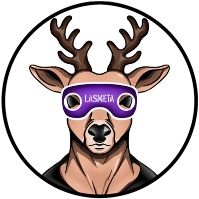

# Lasmeta.io - LASM Token

## Overview

Welcome to the LASM Token repository. LASM is the native ERC20 token for the Lasmeta.io ecosystem, designed to facilitate seamless interactions within our decentralized online multiplayer Texas Hold'em poker game with DEX mechanics. This README provides a comprehensive overview of the project, including technical details, architecture, and the tech stack.

## Table of Contents

- [Lasmeta.io - LASM Token](#lasmetaio---lasm-token)
  - [Overview](#overview)
  - [Table of Contents](#table-of-contents)
  - [Token Details](#token-details)
  - [Architecture](#architecture)
  - [Tech Stack](#tech-stack)
  - [Contracts](#contracts)
    - [LASM Token](#lasm-token)
    - [Liquidity Management](#liquidity-management)
    - [Dividends Distribution](#dividends-distribution)
    - [Fee Management](#fee-management)
    - [Vesting](#vesting)

## Token Details

- **Name**: LASM Token
- **Symbol**: LASM
- **Initial Supply**: 500,000,000 LASM
- **Decimals**: 18

## Architecture

The LASM token is part of a modular (a natural form of eip2535) and extensible architecture designed to support various aspects of the Lasmeta.io ecosystem. The key components of this architecture include:

1. **LASM Token Contract**: Implements the core ERC20 functionality with additional features such as burning, pausing, and reentrancy protection.
2. **Liquidity Management**: Handles automated market making and liquidity provision.
3. **Dividends Distribution**: Manages the distribution of dividends to token holders.
4. **Fee Management**: Allows for flexible and dynamic fee adjustments.
5. **Vesting**: Manages the vesting schedules for token distribution.

Each component is designed to interact seamlessly with others, ensuring a robust and scalable ecosystem.

## Tech Stack

The LASM token and associated contracts are developed using the following technologies:

- **Solidity**: The primary programming language for smart contracts on the Ethereum blockchain.
- **OpenZeppelin**: A library for secure smart contract development. Key modules used include Ownable, ERC20Burnable, Pausable, and ReentrancyGuard.
- **Hardhat**: A development environment for Ethereum software that facilitates deployment, testing, and debugging of smart contracts.
- **Ethers**: A library for interacting with the Ethereum blockchain and its ecosystem.
- **LayerZero**: Utilized for cross-chain interoperability, enabling LASM token functionality across different blockchain networks.

## Contracts

### LASM Token

The core ERC20 token contract with extended functionalities:

- **Burnable**: Tokens can be burned to reduce the total supply.
- **Pausable**: Token transfers can be paused by the owner in case of an emergency.
- **ReentrancyGuard**: Protects against reentrancy attacks.
- **Tax and Dividend Exclusion**: Addresses can be excluded from tax and dividend distributions.

### Liquidity Management

Handles the automated provision of liquidity through integrations with decentralized exchanges like Uniswap.

### Dividends Distribution

Manages the distribution of dividends to token holders, ensuring that all eligible participants receive their share.

### Fee Management

Allows dynamic adjustment of fees for various operations within the ecosystem, including transaction fees and liquidity provision fees.

### Vesting

Manages the vesting schedules for token distributions to team members, partners, and early investors, ensuring a controlled and fair release of tokens over time.
